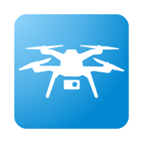

# Solo Toolkit
A desktop-based collection of utilities for the 3DR Solo drone.

### Motivation
The 3DR Solo is a great drone for development. However, changing firmware versions, pulling logs, and performing other tasks on Solo typically involves using SSH and tedious command line tools. Solo Toolkit exposes much of this functionality using Electron, a cross-plaform desktop application framework. This enables both developers and casual users to modify and maintain their Solo.

**A note about cross-plaform capability**

Electron enables cross-platform development, and Solo Toolkit is technically capable of running on multiple platforms. However, all development thus far has been done on macOS and more development is needed to run Solo Toolkit on Linux and Windows.

One of the main barriers to running on Windows it the heavy reliance on SSH. SSH2, the node library used by Solo Toolkit, can leverage Cygwin or Putty to make this work, but this hasn't been implemented or tested. Linux and Windows support are on the roadmap (see below).

### Getting Started
#### If you don't have node

macOS

    brew install node

#### Install global dependencies:

Electron

    npm install electron-prebuilt -g

Gulp

    npm install gulp -g

App dependencies

    npm install

Run in a dev environment

    npm run dev

### Roadmap
Solo Toolkit is very much a work in progress. Below are a list of upcoming features to be added. The list is mostly a collection of ideas and is not necessarily prioritized.
#### UI/app work
- Windows support
- Linux support
- Add tests
- Add system notifications to notify user if app is backgrounded/minimized
- Firmware server integration (to enable download of Solo firmware from 3DR like Â[solo-cli]() does)
- Log plotting and analysis tools

#### Solo related features
- Ability to change control modes for international users
- Mavlink integration (using node-mavlink)
- Arming and motor testing
- Level calibration
- Accel calibration

### Packaging the app
Solo Toolkit leverages [electron-packager]() to create runnable .app packages. To package the app for distribution, run `npm run clean` and `npm run package`. If you'd like to include Chrome dev tools in the resulting package for debugging, run `npm run package-dev`.

The package version is derived from the version specified in `package.json`.
